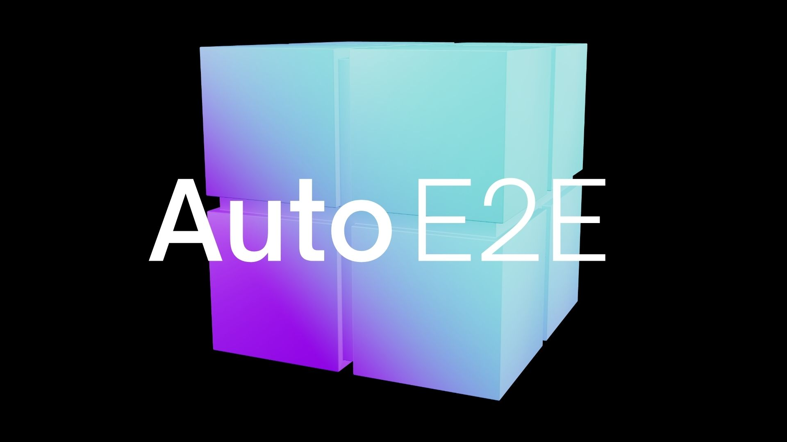

# AutoE2E - End-to-End AI for Self Driving

    <picture>
        <source media="(prefers-color-scheme: dark)">
        
    </picture>

⭐ Star us on GitHub — your support motivates us a lot!

## Free and fully open-source End-to-End AI model
**AutoE2E is an open-source End-to-End AI model** which enables autonomous driving across highways, arterial roads and city streets using cameras-only, and without reliance on HD-maps. 

AutoE2E outputs can be fused with Physics-based sensors such as LIDAR/RADAR to power **fully driverless Robotaxi applications**, and the basline camera-only model can be used to enable **L2++ automotive ADAS** applications for point-to-point hands-free navigation.

To learn more about how to participate in this project, please read the [onboarding guide](/ONBOARDING.md)

## Getting started
- Install the dependencies from the **requirements.txt** file
- Visit the [Model](./Model/) folder to view the model components, run training and perform inference
- See the [Trial Guide](./TRIAL.md) for step-by-step instructions on running the inference test on AWS EC2

## Inference Speed Benchmarks

### NVIDIA GeForce RTX 3060 Laptop GPU 

  
Toggle view

| Backbone | Fusion Method | FPS | Average Latency [ms] | Worst-Case Latency [ms] | Latency Jitter [ms] | Peak VRAM Allocated [MB] | Peak VRAM Reserved [MB] |
| -------- | ------------- | --- | --------------- | ------------------ | -------------- | ------------------- | ------------------ |
| SwinV2 Tiny | Feature Concat | 24.99 | 40.01 | 40.68 | 0.71 | 1067.52 | 1216.00 |
| SwinV2 Tiny | Spatial Attention | 24.48 | 44.49 | 47.23 | 2.75 | 1069.18 | 1218.00 |
| SwinV2 Tiny | BEV Fusion | 22.02 | 45.42 | 67.72 | 23.87 | 1069.18 | 1220.00 |
| ConvNextV2 Tiny | Feature Concat | 22.99 | 43.49 | 49.23 | 7.26 | 1092.58 | 1268.00 |
| ConvNextV2 Tiny | Spatial Attention | 18.60 | 53.75 | 54.15 | 0.36 | 1092.58 | 1268.00 |
| ConvNextV2 Tiny | BEV Fusion | 18.63 | 53.69 | 54.37 | 0.67 | 1092.58 | 1268.00 |

### NVIDIA GeForce RTX 4050 Laptop GPU 

  
Toggle view

| Backbone | Fusion Method | FPS | Average Latency [ms] | Worst-Case Latency [ms] | Latency Jitter [ms] | Peak VRAM Allocated [MB] | Peak VRAM Reserved [MB] |
| -------- | ------------- | --- | --------------- | ------------------ | -------------- | ------------------- | ------------------ |
| SwinV2 Tiny | Feature Concat | 25.76 | 38.81 | 40.60 | 1.80 | 1067.52 | 1216.00 |
| SwinV2 Tiny | Spatial Attention | 24.85 | 40.24 | 41.32 | 1.04 | 1069.18 | 1218.00 |
| SwinV2 Tiny | BEV Fusion | 25.47 | 39.27 | 41.36 | 2.36 | 1069.18 | 1220.00 |
| ConvNextV2 Tiny | Feature Concat | 25.92 | 38.58 | 39.27 | 0.74 | 1092.58 | 1268.00 |
| ConvNextV2 Tiny | Spatial Attention | 23.06 | 43.37 | 52.16 | 9.03 | 1092.58 | 1268.00 |
| ConvNextV2 Tiny | BEV Fusion | 21.70 | 46.09 | 77.30 | 33.68 | 1092.58 | 1268.00 |
  

### NVIDIA GeForce RTX 5080 GPU 

  
Toggle view

  
| Backbone | Fusion Method | FPS | Average Latency [ms] | Worst-Case Latency [ms] | Latency Jitter [ms] | Peak VRAM Allocated [MB] | Peak VRAM Reserved [MB] |
| -------- | ------------- | --- | --------------- | ------------------ | -------------- | ------------------- | ------------------ |
| SwinV2 Tiny | Feature Concat | 118.09 | 8.47 | 8.83 | 0.34 | 1068.52 | 1218.00 |
| SwinV2 Tiny | Spatial Attention | 106.45 | 9.39 | 9.74 | 0.29 | 1070.18 | 1218.00 |
| SwinV2 Tiny | BEV Fusion | 103.26 | 9.68 | 10.02 | 0.30 | 1070.18 | 1220.00 |
| ConvNextV2 Tiny | Feature Concat | 111.24 | 8.99 | 9.28 | 0.25 | 1093.58 | 1284.00 |
| ConvNextV2 Tiny | Spatial Attention | 101.10 | 9.89 | 10.35 | 0.41 | 1093.58 | 1284.00 |
| ConvNextV2 Tiny | BEV Fusion | 98.39 | 10.16 | 10.45 | 0.25 | 1093.58 | 1284.00 

### Add benchmarks for your own GPU .... 

To obtain benchmarks for your GPU, simply run the [benchmarking script](https://github.com/autowarefoundation/auto_e2e/tree/main/Model/speed_benchmark). There, you can also read more about the meaning of benchmark parameters.
